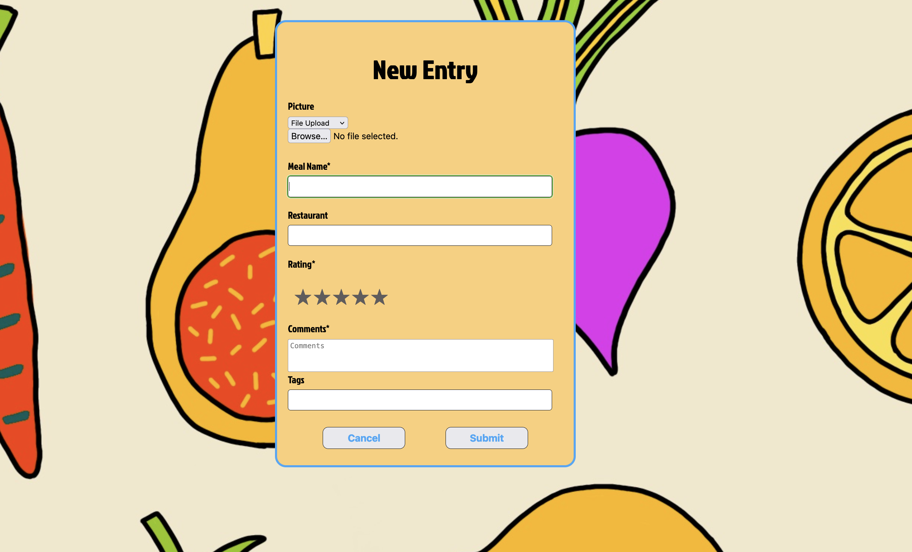

# FoodJournal (v2)
## About
Welcome to Food Journal! This web app empowers food lovers to review meals, share their culinary experiences, and explore what others have tasted. It's a community-driven platform that brings food enthusiasts together, helping each other explore the world of cuisine from the comfort of home. With the aid of AI, Food Journal recommends recipes tailored to your tastes and connects you to the best sources for those recipes. Join us to post your own reviews and share your culinary adventures with the world!

## Installation
No installation required! Food Journal is a web app. Simply navigate to our website to get started.
- https://foodjournal2.netlify.app/

## Usage
- Explore: Browse the homepage to see posts from other food enthusiasts.
- Search Recipes: Visit the recipe page to search for new recipes and get personalized recommendations.
- Join the Community: Sign up and sign in to interact with posts and other users.
- User Profiles: Visit other users' pages to see all their reviews. Click on your profile picture in the nav bar to access your own page, where you can create new reviews or manage existing ones.

## Features
- ### Create and share food journal entries

- ### Discover amazing foods from other users

- ### Get AI-powered recipe recommendations and find new recipes to try out

- ### Customize your profile

## Contributing
We welcome contributions! Please refer to our detailed contributing guide for instructions on how to get involved in developing Food Journal further.

## Possible Future Development
Here are some exciting features suggestions you might add:

- Update Reviews: Ability to update existing review posts.
- Like Reviews: Option to like review posts.
- Comment on Reviews: Ability to comment on review posts.
- Share Recipes: Share discovered recipes from our recipe page.

Join Us!
Whether you're a seasoned chef, a home cook, or someone who simply loves food, Food Journal is the perfect place for you. Explore, share, and discover new culinary delights every day. Happy journaling!

### Our Development [Team](teamPage.md)

