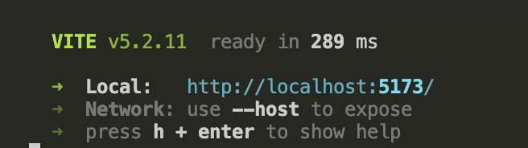

# Running Frontend on Your Machine

1) **Install NPM**

    Open a terminal and run:
    ```
    npm install
    ```

2) **Running project locally**

    In the terminal, run:

    ```
    npm run dev
    ```

    Once VITE is open and you see this: 
    

    Press "o" (the letter o) and enter. This should open up the website locally in a browser.


